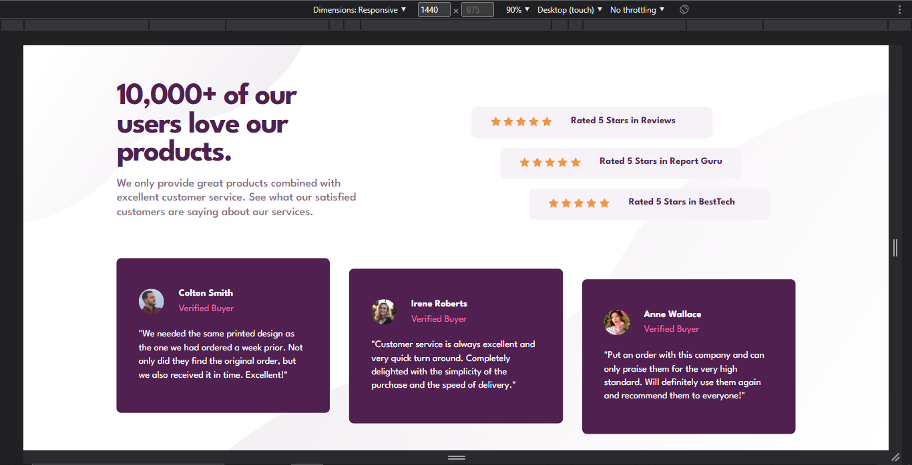
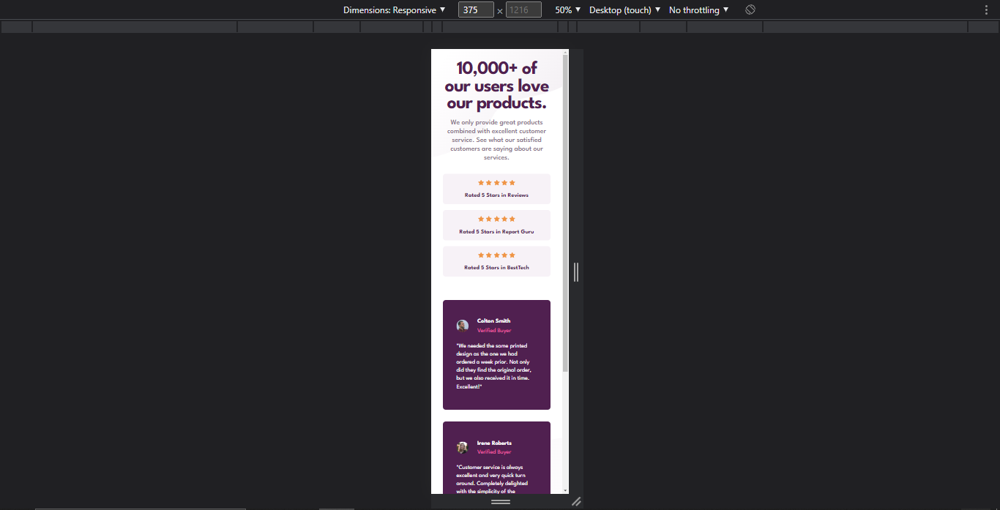
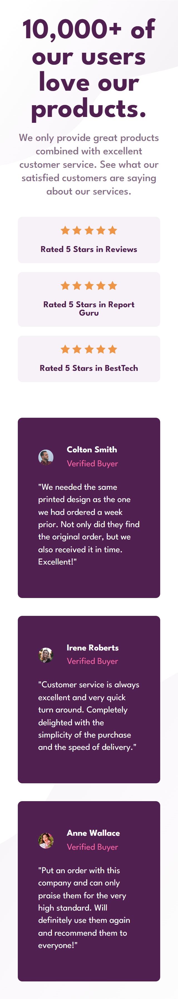

# Frontend Mentor - Social proof section solution

This is a solution to the [Social proof section challenge on Frontend Mentor](https://www.frontendmentor.io/challenges/social-proof-section-6e0qTv_bA). Frontend Mentor challenges help you improve your coding skills by building realistic projects. 

## Table of contents

- [Overview](#overview)
  - [The challenge](#the-challenge)
  - [Screenshot](#screenshot)
  - [Links](#links)
- [My process](#my-process)
  - [Built with](#built-with)
  - [What I learned](#what-i-learned)
  - [Continued development](#continued-development)
  - [Useful resources](#useful-resources)
- [Author](#author)
- [Acknowledgments](#acknowledgments)


## Overview

This challenge was fun and easy to do. The only tricky part was to get the elements aligned in steps like the design. I tried to use a combination of flexbox and auto margins but that did nothing so I used transforms and relative positioning instead, and it turned out great. 

The page is responsive, I finally learned how to position backround images correctly and explored the svg format. There's alot that I still need to know but I like the fact that you can do so much with svgs that you can't do with other formats.

### The challenge

Users should be able to:

- View the optimal layout for the section depending on their device's screen size

### Screenshot

Desktop


Mobile


Full Mobile Screenshot



### Links

- Solution URL: [My Frontend Mentor Profile](https://www.frontendmentor.io/profile/dxiDavid)
- Live Site URL: [Go live](https://social-proof-section-challenge.pages.dev)

## My process

I started by structuring the content in HTML then moved on to positioning everything where it should be (relatively speaking) without any styles.

Next i set the font styles and sizes and added the background image. I slightly increased the opacity of the svgs to see them a little bit better when positioning. 

Once that was done, I refined the styles so I could get as close to the design as possible. I appreciate the fact that the project assets were already optimized to fit the design so they were easy to work with. 

After I was happy with how everrything looked, I proceed to make it look good on mobile with two media queries and It was pretty much done.

### Built with

- Semantic HTML5 markup
- CSS 
- Flexbox

### What I learned

I looked into positioning elements with margins though I didn't end up using them. I also learned how to debug CSS by setting an solid coloured outline on every element or a very soft background (if needed). 

```css
*{
  outline: 2px solid rgba(255, 0, 0, 0.281);
}
```

I wish I knew this sooner since it would have saved me hours of debbuging on previous challenges but oh well😂

### Continued development

I used flexbox on this and once I learn grid, I'm definitely going to try it out with this challenge.

### Useful resources

- [Youtube](https://www.youtube.com/@KevinPowell) - This is where I found the best tutorials and explanations (For me) on CSS concepts and      writing functional CSS. Kevin Powel really knows his stuff and gives concise explanations.
- [w3schools](https://w3schools.com) - This website has an entire course on CSS with simple examples for both basic and advanced concepts.
- [CSS Tricks](https://css-tricks.com/) - This website provides very well written explanations to CSS concepts as well as examples for when you need to revisit a concept.
- [mdn](https://developer.mozilla.org/en-US/) - Always helpful to read the documentation of any language.


## Author

- Frontend Mentor - [@dxiDavid](https://www.frontendmentor.io/profile/dxiDavid)
- Twitter - [@dxidavid254](https://www.twitter.com/dxidavid254)

